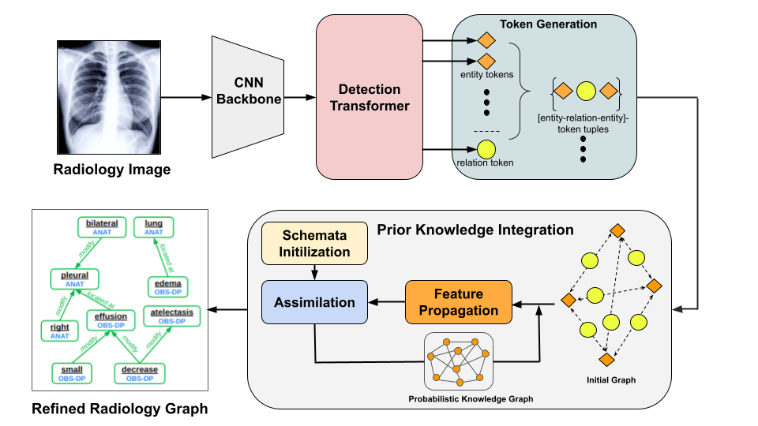

# Prior-RadGraphFormer: A Prior-Knowledge-Enhanced Transformer for Generating Radiology Graphs from X-Rays
[[`arXiv`](https://arxiv.org/abs/2303.13818)]
[[`BibTex`](#citation)]

Code release for the GRAIL @ MICCAI 2023 paper "Prior-RadGraphFormer: A Prior-Knowledge-Enhanced Transformer for Generating Radiology Graphs from X-Rays".


Prior-RadGraphformer is a transformer-based network aiming at directly generating radiology graphs from radiology X-rays. Generated graphs can be used for multiple downstream tasks such as free-text reports generation and pathologies classification.

# Installation
We recommend using python3.8 and following scripts to install required python packages
```
python -m venv /path/to/new/virtual/environment
source /path/to/new/virtual/environment/bin/activate
pip install -r requirements.txt
```

# How to train the Prior-RadGraphFormer

## Preparing the data (coming soon)

## Preparing the config file
The config file can be found at `.configs/radgraph.yaml`. Make custom changes if necessary.

## Training
```
python train.py
```


# <a name="citation"></a> Citation

If you find this code helpful, please consider citing:
```BibTeX
@misc{xiong2023priorradgraphformer,
      title={Prior-RadGraphFormer: A Prior-Knowledge-Enhanced Transformer for Generating Radiology Graphs from X-Rays}, 
      author={Yiheng Xiong and Jingsong Liu and Kamilia Zaripova and Sahand Sharifzadeh and Matthias Keicher and Nassir Navab},
      year={2023},
      eprint={2303.13818},
      archivePrefix={arXiv},
      primaryClass={cs.CV}
}
```

# Acknowledgement
This code borrows heavily from [Relationformer](https://github.com/suprosanna/relationformer/tree/scene_graph), [Classification by Attention](https://github.com/sharifza/schemata). We thank the authors for their great work.

The authors gratefully acknowledge the financial support by the Federal Ministry of Education and Research of Germany (BMBF) under project DIVA (FKZ 13GW0469C). Kamilia Zaripova was partially supported by the Linde & Munich Data Science Institute, Technical University of Munich Ph.D. Fellowship.